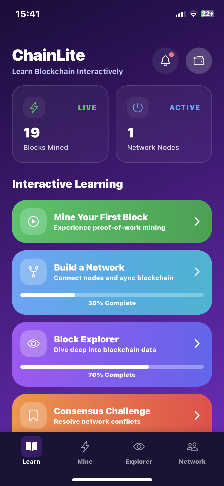
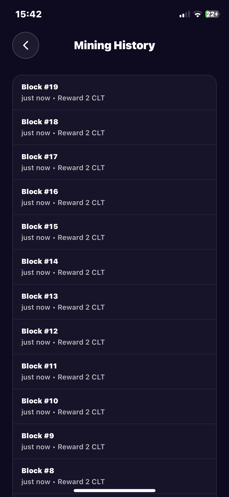
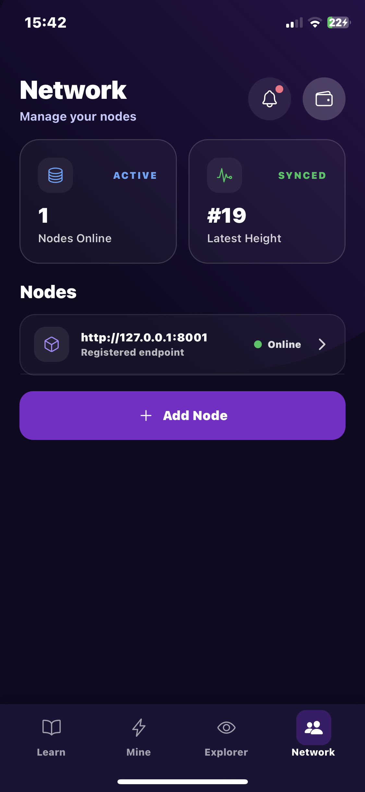
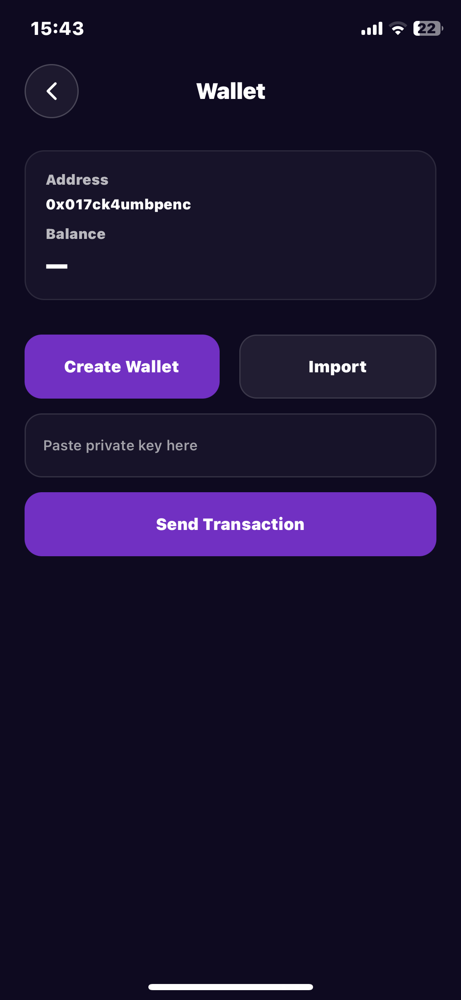
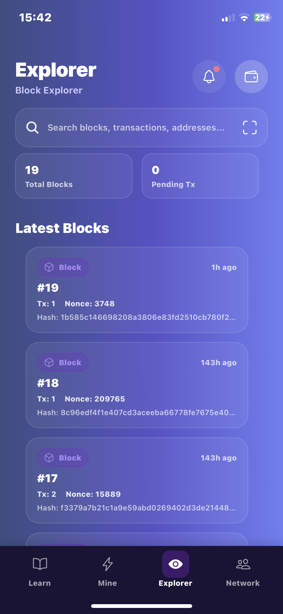

# ChainLiteMobile

Empower learners to understand blockchain by doing. ChainLiteMobile is an interactive mobile app that teaches core concepts—mining, peer-to-peer networking, block exploration, and consensus—through guided, hands-on modules.


---

## Table of Contents

1. Overview
2. Features
3. Tech Stack
4. Getting Started
5. Configuration (API Base URL)
6. Development Scripts
7. Build (APK / Local)
8. Screenshots
9. Architecture
10. Performance Notes
11. Contributing

---

## Overview

ChainLiteMobile pairs a clean, modern UI with an educational flow that progressively introduces blockchain mechanics. It speaks to both newcomers and builders who want to see how the pieces fit together in practice.

## Getting Started

1) Install dependencies

   ```bash
   npm install
   # or
   yarn
   ```

2) Configure backend URL (optional)

   The app defaults to the production backend: `https://chainlite.onrender.com`.

   You can override via env at runtime:

   ```bash
   EXPO_PUBLIC_API_BASE_URL="https://your-backend" npx expo start
   ```

   Or in-app from Settings: see `Settings → API Base URL` (writes to SecureStore).

3) Start the app

   ```bash
   npx expo start
   ```

In the output, you'll find options to open the app in a

- [development build](https://docs.expo.dev/develop/development-builds/introduction/)
- [Android emulator](https://docs.expo.dev/workflow/android-studio-emulator/)
- [iOS simulator](https://docs.expo.dev/workflow/ios-simulator/)
- [Expo Go](https://expo.dev/go), a limited sandbox for trying out app development with Expo

You can start developing by editing the files inside the **app** directory. This project uses [file-based routing](https://docs.expo.dev/router/introduction).


## Features

- Interactive modules: Mining, Network Builder, Block Explorer, Consensus Challenge
- Production API default with secure, user-overridable base URL
- Optimized polling: mining status polls only when screen is focused, every 15s
- Dark, gradient UI with custom headers and icons
- TypeScript-first services and hooks

## Tech Stack

- React Native + Expo Router (file-based navigation)
- TypeScript across app and services
- Axios for API calls (`src/services/blockchain.ts`)
- Expo SecureStore for persisting user API base URL

## Architecture

- UI routes: `app/` with Expo Router (tabs under `app/(tabs)/`)
- Mining UI: `components/MiningScreen.tsx`
- Backend service layer: `src/services/blockchain.ts` (Axios instance, endpoints)
- Global init: `app/_layout.tsx` calls `initializeApiBaseUrl()` and sets a light StatusBar
- Settings UI for API URL: `app/settings/index.tsx`, `app/mine/settings.tsx`

## Configuration (API Base URL)

Resolution priority for the API base URL (`src/services/blockchain.ts`):
1. `EXPO_PUBLIC_API_BASE_URL` environment variable
2. SecureStore value saved from Settings
3. Default: `https://chainlite.onrender.com`

Changes persist locally and update the Axios instance at runtime.

## Development Scripts

Commonly used scripts:

```bash
npm start           # Launch Expo
npm run android     # Open on Android emulator/device
npm run ios         # Open on iOS simulator
npm run lint        # Lint codebase
```

## Build (Android APK)

Recommended: EAS Build (cloud):

```bash
npm i -g eas-cli   # or: yarn global add eas-cli
eas login
eas build:configure
eas build -p android --profile preview   # produces an APK you can download
```

Local build (requires Android SDK):

```bash
npx expo prebuild --platform android
cd android && ./gradlew :app:assembleRelease
# APK: android/app/build/outputs/apk/release/app-release.apk
```

## Screenshots

> A few representative screens from the app.







## Directory structure

- `app/` — Screens and routes (Expo Router)
- `components/` — Reusable UI components
- `src/services/blockchain.ts` — API client and endpoints
- `src/contexts/` — Context providers (e.g., wallet)
- `utils/` — Utilities
- `scripts/` — Local test scripts


## Screenshots




## Performance Notes

- Mining status polling limited to focused screen and every 15s to protect backend free tier
- Intervals are properly cleaned up on unmount/blur

## Contributing

Contributions, issues, and feature requests are welcome. Please open a GitHub issue or submit a PR. For larger changes, consider opening a discussion first to align on scope and approach.

## Get a fresh project

When you're ready, run:

```bash
npm run reset-project
```

This command will move the starter code to the **app-example** directory and create a blank **app** directory where you can start developing.

## Learn more

To learn more about developing your project with Expo, look at the following resources:

- [Expo documentation](https://docs.expo.dev/): Learn fundamentals, or go into advanced topics with our [guides](https://docs.expo.dev/guides).
- [Learn Expo tutorial](https://docs.expo.dev/tutorial/introduction/): Follow a step-by-step tutorial where you'll create a project that runs on Android, iOS, and the web.

## Join the community

Join our community of developers creating universal apps.

- [Expo on GitHub](https://github.com/expo/expo): View our open source platform and contribute.
- [Discord community](https://chat.expo.dev): Chat with Expo users and ask questions.
